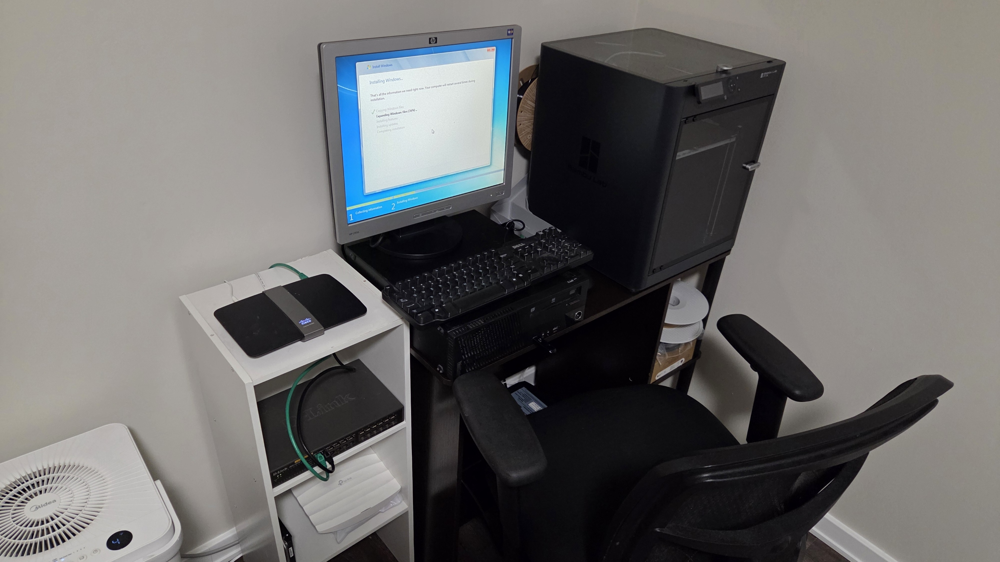

## Home Lab Setup

### Network Diagram

SaskTel Router (Home network - 192.X.X.X) -->

-->  Linksys E4200 (Lab gateway - 192.X.X.X) (Bought a used router for the lab) -->

  --> D-Link DES-1024D 24-Port unmanaged switch (Got it for free, I wiil get a managed one as soon as I can) -->
      --> Windows 7 Target machine (Older Lenovo ThinkCentre)

### Lab Router - Linksys E4200
- IP: Set up ....
- DHCP range: Set up ....
-  Security: WPA2 Personal
-  Remote Management: Disabled
-  UPnP: Disabled
-  Admin password: set

### Windows 7 Target Machine
- Lenovo ThinkCentre
- Intel i5-4570 @ 3.20GHz
- 4GB RAM
- 500GB HDD (replaced failing drive)
- Windows 7 Professional
- IP: X.X.X.X (DHCP)
- Purpose: vulnerable legacy target for exploitation practice

### Troubleshooting Notes
- Original hard drive failed - clicking sounds + CHKDSK abort
- Replaced with spare 500GB HDD, clean install worked
- After changing router to a custom lab subnet separate from home network
  the target machine lost connection
- Fixed with: ipconfig /release then ipconfig /renew
- This forces Windows to request a new IP from the router
  on the updated network range

### Planned Additions
- I currently have a few more older towers that could be added to the lab.
- Tower 2: Windows 10/11 target for a newer system practice
- Tower 3: Ubuntu target  for Linux practice
- Lexmark laser printer: IoT target device (Plus additional hardware troubleshooting skill)
- TP-Link managed switch: for VLAN practice (Unless I find a different used one)
- Raspberry Pi: DNS server or monitoring tool
- Kali Linux VM on laptop: primary attack machine (Using VM on my personal laptop since it is the most powerful one out all the units.
